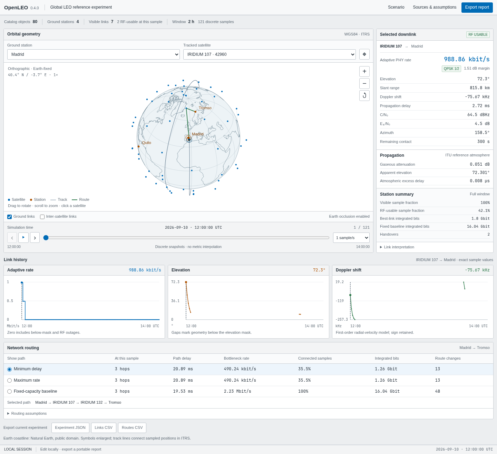

# OpenLEO

OpenLEO is an open Python tool for reproducible studies of time-varying
low-Earth-orbit satellite-to-ground links. It combines archived GP orbital data,
explicit station and RF assumptions, reference atmospheric propagation, adaptive
reference rates, snapshot routing, and portable scientific artifacts.

It is designed for researchers who need inspectable model inputs and repeatable
comparisons, not an operational link planner or a reconstruction of a commercial
network.



## Choose a workflow

| Goal | Command or entry point |
| --- | --- |
| Inspect a constellation locally | `openleo app CONSTELLATION.json` |
| Export an interactive constellation report | `openleo constellation CONSTELLATION.json --output DIRECTORY` |
| Compare sampling and propagation fidelity | `openleo fidelity-study STUDY.json --output DIRECTORY` |
| Compare free space and reference atmosphere | `openleo propagation-study CONSTELLATION.json --output DIRECTORY` |
| Generate a single visible-pass trace | `openleo run SCENARIO.json --output DIRECTORY` |
| Run a deterministic one-at-a-time study | `openleo sensitivity SCENARIO.json SENSITIVITY.json --output DIRECTORY` |
| Check homogeneous P.676-13 attenuation | `openleo gases CONFIG.json --output DIRECTORY` |

The [scope and claim boundary](docs/SCOPE.md) explains what each workflow can and
cannot establish.

## Install from the repository

OpenLEO requires Python 3.12 or newer. The recommended user installation uses
[`uv`](https://docs.astral.sh/uv/):

```bash
git clone https://github.com/SodaFMR/openleo.git
cd openleo
uv sync --locked --no-dev
```

Commands below use `uv run --no-dev` so development dependencies are not installed.
Static figures additionally require the optional plotting dependency:

```bash
uv sync --locked --no-dev --extra plot
```

See [Contributing](CONTRIBUTING.md) for the separate development environment.

## Quick start: constellation workbench

Launch the reference-atmosphere example:

```bash
uv run --no-dev openleo app \
  examples/constellations/iridium_global_reference.json
```

The browser opens a local application at `http://127.0.0.1:8765/`. Select stations
and satellites, move through the UTC samples, inspect link budgets, and compare route
models. Computation stays local; the display replays model samples from archived
elements and is not live telemetry.

Export the same experiment without running a server:

```bash
uv run --no-dev openleo constellation \
  examples/constellations/iridium_global_reference.json \
  --output runs/global
```

Open `runs/global/explorer.html` directly in a browser. The bundle also includes
`experiment.json`, `links.csv`, `routes.csv`, and `manifest.json`.

The example uses 80 archived public CelesTrak GP records and four declared station
locations. Its terminal, network, and RF settings are research assumptions, not
descriptions of Iridium hardware or service.

## Reproducible fidelity study

Run the committed comparison across two declared frequencies and three sampling
steps:

```bash
uv run --no-dev openleo fidelity-study \
  examples/studies/reference_fidelity.json \
  --output runs/fidelity
```

Open `runs/fidelity/index.html`. The study keeps each scenario's station, frequency,
and RF settings intact while comparing `free_space`, `reference`, and `refined`
propagation variants at 30, 60, and 120 second sampling. The two cases use explicit
12 GHz and 20 GHz frequencies with the same declared gains and EIRP; this is not a
fixed-aperture comparison or a claim about Ka-band or operator performance.

The bundle contains:

| File | Contents |
| --- | --- |
| `fidelity-study.json` | Study inputs, run provenance, metrics, comparisons, and limitations |
| `station-metrics.csv` | Per-station visibility, RF usability, rates, and integrated-bit deltas |
| `route-metrics.csv` | Per-routing-model connectivity, bottleneck rates, and integrated-bit deltas |
| `index.html` | Self-contained visual comparison |
| `manifest.json` | SHA-256 fingerprints for the top-level artifacts |

Every child run remains a normal workbench bundle under `cases/`. The finest
declared time step and doubled atmospheric layer grid are numerical references, not
truth, convergence proofs, observations, or uncertainty estimates. See
[Fidelity studies](docs/FIDELITY_STUDIES.md) for the input contract, duration
semantics, metrics, and validation rules.

## Python API

Run and write a constellation experiment:

```python
from openleo import (
    add_network,
    load_constellation,
    simulate_constellation,
    write_workbench,
)

scenario = load_constellation(
    "examples/constellations/iridium_global_reference.json"
)
document = add_network(simulate_constellation(scenario))
write_workbench(document, "runs/global-python")
```

Run a fidelity study and verify the resulting bundle:

```python
from openleo.fidelity_io import load_fidelity_result
from openleo.fidelity_study import load_fidelity_study, run_fidelity_study

study = load_fidelity_study("examples/studies/reference_fidelity.json")
run_fidelity_study(study, "runs/fidelity-python")
summary = load_fidelity_result("runs/fidelity-python")
```

Public paths accept strings or `pathlib.Path` values. Invalid schemas, non-finite
inputs, unsupported physical domains, source-hash mismatches, and inconsistent output
bundles raise errors rather than being silently ignored.

## Models and methods

- [Methods](docs/METHODS.md): frames, time, sampling, link-budget equations, adaptation,
  routing, and worked calculations.
- [Scientific workbench](docs/WORKBENCH.md): configuration, exported schemas, UI, and
  security boundaries.
- [Reference propagation](docs/REFERENCE_PROPAGATION.md): P.835-7, P.453-14, and
  P.676-13 profile integration, refraction, and delay.
- [Deterministic sensitivity](docs/SENSITIVITY.md): one-at-a-time method and exact
  frozen benchmark.
- [P.676-13 specific attenuation](docs/GASES.md): homogeneous-state equations,
  official cases, and source attribution.
- [Validation](docs/VALIDATION.md): regression evidence, independent checks, and
  validation still required.

Numeric public fields carry units in their names. UTC timestamps are timezone-aware.
Raw input bytes, source records, generated artifacts, software versions, and
limitations are fingerprinted or recorded where the workflow supports them.

## Important limitations

OpenLEO does not model local weather, rain, cloud, fog, scintillation, antenna
radiation patterns, beam scheduling, interference, packet traffic, queues,
retransmissions, transport protocols, or real operator behavior.

The reference atmosphere is an idealized global profile. Receiver noise temperature
stays fixed; atmospheric emission and frequency-dependent group delay are absent.
Snapshot routes contain no traffic demand or contention.

Shannon-Hartley capacity is a theoretical upper bound. DVB-S2 values are ideal AWGN
reference rates. Neither is measured throughput or achieved goodput. Archived fitted
orbital elements are not exact trajectories, and checksum agreement is not physical
validation.

## Citation, license, and data terms

If OpenLEO supports your work, cite the software using [`CITATION.cff`](CITATION.cff).
No DOI is claimed. OpenLEO source code is MIT licensed; see [`LICENSE`](LICENSE).

Archived input provenance and terms are documented in
[`THIRD_PARTY_DATA.md`](THIRD_PARTY_DATA.md). Adapted implementation notices are in
[`THIRD_PARTY_NOTICES.md`](THIRD_PARTY_NOTICES.md).

Contributions are welcome; start with [`CONTRIBUTING.md`](CONTRIBUTING.md).
