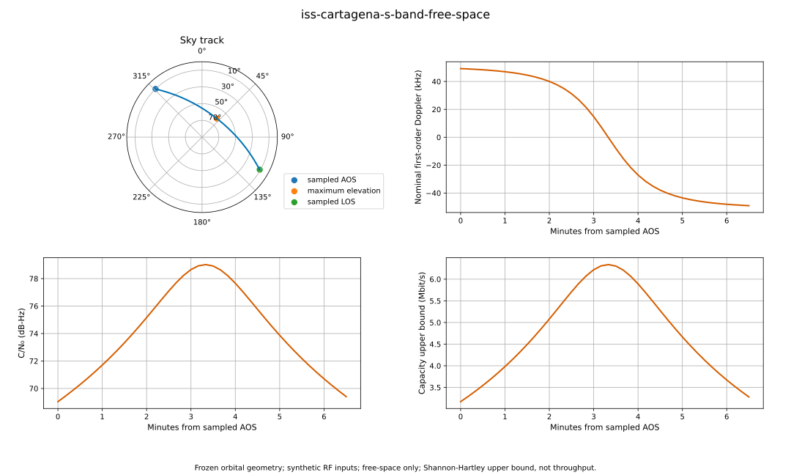
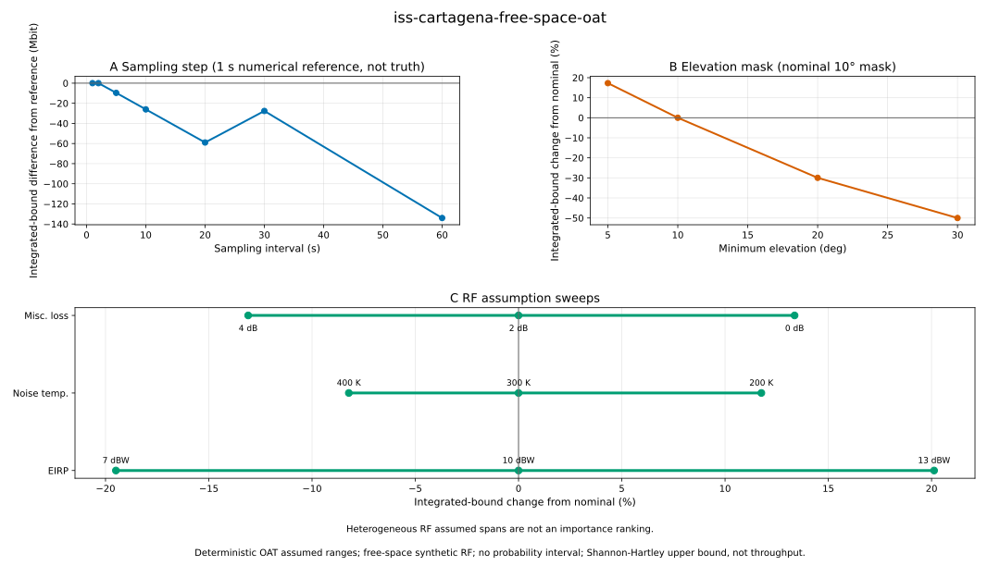

# OpenLEO

OpenLEO is an open, reproducible Python tool for studying time-varying
satellite-to-ground links in Low Earth Orbit (LEO).

v0.1 is intentionally narrow: it reads one frozen CelesTrak GP CSV record, one
ground station, one UTC window, and one transparent RF scenario, then writes a
deterministic visible-pass trace and summary. v0.2a1 adds a deterministic
one-at-a-time sensitivity benchmark over declared sampling, elevation-mask, and
synthetic RF assumptions without adding probabilistic uncertainty claims.

OpenLEO is research software. It is not an orbit-determination system, waveform
simulator, operational network-planning tool, calibrated validation study, or
peer-reviewed performance result.

## Install

Prerequisites:

- Python 3.12 or newer
- `uv` for the recommended workflow

Recommended setup:

```bash
uv sync --locked --group dev --extra plot
```

Standard Python fallback:

```bash
python -m venv .venv
```

Activate the virtual environment:

```bash
source .venv/bin/activate
```

Windows PowerShell:

```powershell
.venv\Scripts\Activate.ps1
```

Then install the package and development tools:

```bash
python -m pip install -e ".[plot]"
python -m pip install build pytest pytest-cov ruff
```

## Run The Frozen Example

```bash
uv run openleo run examples/scenarios/iss_cartagena.json --output runs/iss
uv run openleo plot runs/iss --output runs/iss/pass-overview.svg
```

The commands exit with status 0 and write:

- `runs/iss/trace.csv`
- `runs/iss/summary.json`
- `runs/iss/pass-overview.svg`

They also print stable labels suitable for CI:

```text
scenario: iss-cartagena-s-band-free-space
rows: 40
sampled AOS: 2026-08-30T06:15:30Z
sampled LOS: 2026-08-30T06:22:00Z
trace: runs/iss/trace.csv
summary: runs/iss/summary.json
plot: runs/iss/pass-overview.svg
```

`runs/` is ignored by Git so regenerated examples do not pollute commits.

The ISS pass geometry is sourced from the frozen CelesTrak GP record described in
[THIRD_PARTY_DATA.md](THIRD_PARTY_DATA.md). All RF values in the example scenario
are synthetic OpenLEO assumptions, not measurements of ISS hardware, Cartagena
station hardware, commercial service, or achieved throughput.



The figure reads the frozen `trace.csv` and `summary.json` artifacts; it does not
recompute the pass. Its orbital geometry is frozen and its RF inputs are synthetic.
It is free-space only, and its Shannon-Hartley curve is an upper bound, not throughput.
Regenerate the committed figure after the command above with:

```bash
uv run openleo plot runs/iss --output docs/images/iss-cartagena-pass-overview.svg
```

Repository attributes force LF endings for frozen CSV and JSON inputs so their
raw-byte fingerprints remain identical on Linux, macOS, and Windows.

## Run The Deterministic Sensitivity Benchmark

```bash
uv run openleo sensitivity \
  examples/scenarios/iss_cartagena.json \
  examples/sensitivity/iss_cartagena_oat.json \
  --output runs/iss-sensitivity
uv run openleo plot-sensitivity runs/iss-sensitivity \
  --output runs/iss-sensitivity/sensitivity-overview.svg
```

The commands write:

- `runs/iss-sensitivity/sensitivity.csv`, with one row for each of 20 declared cases;
- `runs/iss-sensitivity/sensitivity-summary.json`, with the complete portable baseline,
  fitted-record epoch/age and leap-table context, warnings, sweeps, fingerprints,
  versions, formatting rules, and limitations; and
- `runs/iss-sensitivity/sensitivity-overview.svg`, rendered from those completed
  artifacts without rerunning the cases.

The computation command does not require Matplotlib. The committed figure is regenerated
with:

```bash
uv run openleo plot-sensitivity runs/iss-sensitivity \
  --output docs/images/iss-cartagena-sensitivity-overview.svg
```



The [deterministic sensitivity method and frozen benchmark](docs/SENSITIVITY.md)
document the exact configuration, fields, results, references, and allowed claims. The
study changes one input at a time across assumed values. It is not an uncertainty
interval; the figure's 1 s sampling case is a numerical reference, not truth; and the
heterogeneous RF spans are not a parameter-importance ranking.

The baseline context is retrospective: it is copied from the completed unchanged
baseline run against one frozen fitted GP record. It is not a pre-pass prediction
artifact or an orbit-accuracy guarantee.

## Outputs

`trace.csv` contains one row per visible sample at or above the configured elevation
mask. Public numeric fields include units in their names:

- `timestamp_utc`: sample time in ISO 8601 UTC
- `azimuth_deg`, `elevation_deg`: topocentric look angles
- `range_m`, `range_rate_mps`: slant range and radial range rate
- `delay_s`: one-way vacuum propagation delay
- `doppler_hz`: nominal first-order downlink Doppler shift
- `free_space_path_loss_db`: free-space path loss
- `received_carrier_power_dbw`: received carrier power
- `noise_density_dbw_per_hz`: thermal noise density
- `carrier_to_noise_density_db_hz`: `C/N0`
- `signal_to_noise_ratio_db`: SNR over the configured bandwidth
- `shannon_capacity_upper_bound_bps`: Shannon-Hartley theoretical upper bound

The public sign convention is `range_rate_mps < 0` while approaching and
`range_rate_mps > 0` while separating. Downlink Doppler uses the opposite sign:
approach produces positive `doppler_hz`, and departure produces negative `doppler_hz`.

`summary.json` records schema version, scenario name, every parsed station,
time-window, and RF input, the authoritative scenario-byte SHA-256, orbit and
leap-second-table provenance, element epoch and signed endpoint ages, package versions,
warnings, limitations, row count, sampling interval, sampled AOS/LOS, sampled duration,
extrema, and `integrated_capacity_upper_bound_bits`. The frozen scenario JSON bytes are
authoritative and fingerprinted before parsing; JSON output repeats parsed values with
12 significant digits for finite floats, so it does not preserve their original textual
precision. AOS/LOS are sample-grid estimates; true elevation-mask crossings are not
interpolated.

The inclusive time grid is limited to 100,000 samples. Sampling intervals must be
positive and exactly representable by Python's microsecond-resolution `timedelta`
within `1e-12` seconds; sub-microsecond intervals or values requiring more rounding
are rejected.

## Reference Result

These values are from the verified frozen example command above.

| Field | Value |
| --- | ---: |
| `row_count` | 40 |
| `sampled_aos_utc` | `2026-08-30T06:15:30Z` |
| `sampled_los_utc` | `2026-08-30T06:22:00Z` |
| `sampled_duration_s` | 390 |
| `maximum_elevation_deg` | 61.5799734359 |
| `minimum_range_m` | 473676.7193 |
| `maximum_capacity_upper_bound_bps` | 6336955.32414 |
| `integrated_capacity_upper_bound_bits` | 1867325705.98 |

## Study The Model

Start with [OpenLEO Fundamentals](docs/FUNDAMENTALS.md). It is a self-contained
six-lesson mini-course covering only the concepts used by v0.1, with worked reference
examples, focused test commands, checkpoints, exercises, and answer keys.

The [Project Charter](docs/PROJECT_CHARTER.md) is the advanced reference for the
research question, future scope, scientific integrity rules, paper plan, and complete
standards list. You do not need to read it before the Fundamentals course.

[Validation](docs/VALIDATION.md) separates engine regression, hand-derived checks,
finite-difference checks, and the calibrated observation still required for physical
validation.

Read [Deterministic Sensitivity](docs/SENSITIVITY.md) for the v0.2a1 OAT method,
canonical 20-case configuration, frozen results, GUM terminology boundary, and
prohibited claims.

Then read the source in this order:

1. [src/openleo/model.py](src/openleo/model.py) for validated scenario objects.
2. [src/openleo/input.py](src/openleo/input.py) for scenario JSON loading and validation.
3. [src/openleo/orbit.py](src/openleo/orbit.py) for frozen GP CSV loading and
   Skyfield/SGP4 propagation.
4. [src/openleo/physics.py](src/openleo/physics.py) for delay, Doppler, link-budget,
   and capacity equations.
5. [src/openleo/simulation.py](src/openleo/simulation.py) for pass assembly and
   integration.
6. [src/openleo/output.py](src/openleo/output.py) for deterministic CSV/JSON output.
7. [src/openleo/sensitivity.py](src/openleo/sensitivity.py) for deterministic study
   validation, immutable case execution, and sensitivity CSV/JSON output.
8. [src/openleo/plotting.py](src/openleo/plotting.py) for static pass plots from
   completed run artifacts.
9. [src/openleo/sensitivity_plotting.py](src/openleo/sensitivity_plotting.py) for strict
   sensitivity-artifact reading and static sensitivity plots.
10. [src/openleo/cli.py](src/openleo/cli.py) for all four public commands.

## Verification Commands

```bash
uv sync --locked --group dev --extra plot
uv lock --check
uv run ruff check src tests
uv run ruff format --check src tests
uv run pytest --cov=openleo --cov-report=term-missing --cov-report=xml --cov-fail-under=80
uv run python -m build
uv run python - <<'PY'
from pathlib import Path, PurePosixPath
import tarfile

archives = list(Path("dist").glob("*.tar.gz"))
assert len(archives) == 1, f"expected one sdist, found {len(archives)}"
forbidden = {"coverage.xml", "dist", "runs"}
with tarfile.open(archives[0], "r:gz") as archive:
    invalid = [
        member.name
        for member in archive.getmembers()
        if (path := PurePosixPath(member.name)).is_absolute()
        or (
            len(path.parts) > 1
            and path.parts[1].startswith(".")
            and path.parts[1] != ".gitignore"
        )
        or forbidden.intersection(path.parts)
    ]
assert not invalid, f"invalid sdist members: {invalid}"
print(f"sdist members clean: {archives[0]}")
PY
uv run openleo run examples/scenarios/iss_cartagena.json --output runs/iss
uv run openleo plot runs/iss --output docs/images/iss-cartagena-pass-overview.svg
uv run openleo sensitivity examples/scenarios/iss_cartagena.json \
  examples/sensitivity/iss_cartagena_oat.json --output runs/iss-sensitivity
uv run openleo plot-sensitivity runs/iss-sensitivity \
  --output docs/images/iss-cartagena-sensitivity-overview.svg
uvx cffconvert --validate
git diff --exit-code -- docs/images/iss-cartagena-pass-overview.svg \
  docs/images/iss-cartagena-sensitivity-overview.svg
git diff --check
```

## Limitations

v0.1 is free-space only. It has no atmospheric gases, rain, cloud, fog,
scintillation, atmospheric refraction, antenna radiation patterns, beam steering,
interference, polarization, MODCOD tables, packet traffic, routing, live downloads,
hardware control, or calibrated-observation validation.

Shannon-Hartley capacity is reported only as a theoretical upper bound. It is not
throughput, achieved goodput, commercial service performance, or validation of any
real RF link.

The OAT benchmark uses deterministic assumed ranges, not probability distributions.
It propagates no input uncertainty or covariance and reports no confidence, credible,
coverage, or standard-uncertainty interval. Its results apply only to the frozen public
orbit record, selected time window and station, synthetic RF assumptions, and
free-space model.

## Roadmap

- v0.1: deterministic free-space pass trace, static pass overview, CLI, example, tests,
  and CI.
- v0.2a1: deterministic OAT sensitivity reporting for sampling, elevation-mask, and
  synthetic RF assumptions.
- v0.2: validated propagation-model subsets and justified uncertainty reporting.
- v0.3: adaptive link state with cited thresholds and useful-rate estimates.
- v0.4: network-simulator trace export and fixed-versus-dynamic comparison.
- v1.0: reproducible paper release with archived software/data release.

## Contributing, Citation, And Data Terms

- [CONTRIBUTING.md](CONTRIBUTING.md)
- [CITATION.cff](CITATION.cff)
- [THIRD_PARTY_DATA.md](THIRD_PARTY_DATA.md)
- [LICENSE](LICENSE)
