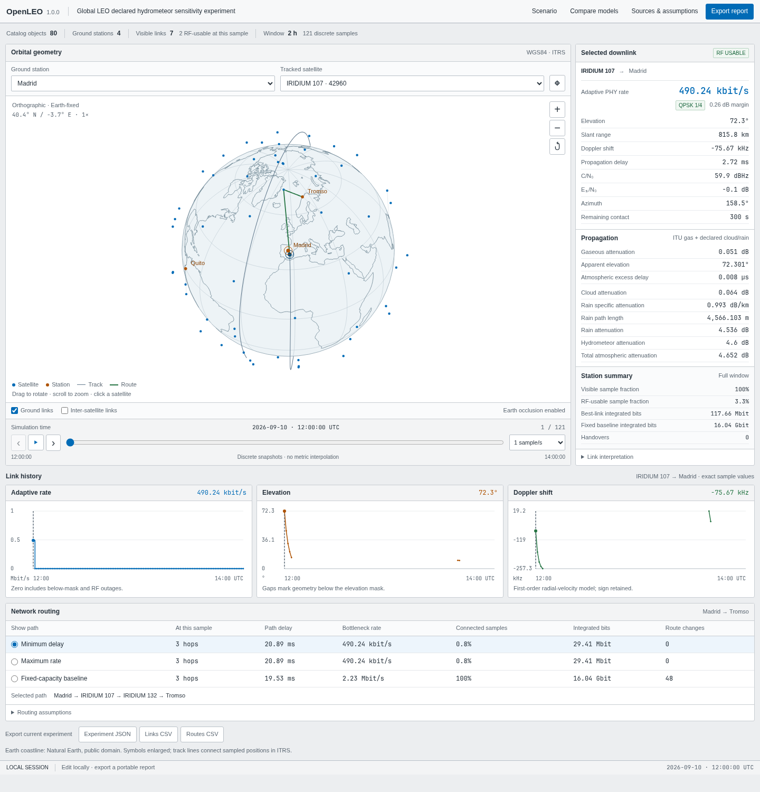

# OpenLEO

OpenLEO is an open Python tool for reproducible studies of time-varying
low-Earth-orbit links and networks. It combines archived GP orbital data,
declared station and RF inputs, reference atmospheric propagation, adaptive
reference rates, snapshot routing, and optional native ns-3 packet experiments.

Researchers can compare free space, reference gases, and declared uniform rain
and cloud conditions in one aligned experiment, inspect the results locally,
and export portable scientific artifacts. The models do not reconstruct an
operational network or infer local weather.



## Choose a workflow

| Goal | Command or entry point |
| --- | --- |
| Inspect, configure, and compare experiments locally | `openleo app CONSTELLATION.json` |
| Export an interactive constellation report | `openleo constellation CONSTELLATION.json --output DIRECTORY` |
| Compare propagation with optional link or network packets | `openleo experiment CONSTELLATION.json --settings SETTINGS.json --output DIRECTORY` |
| Replay selected multi-hop routes with shared queues | `openleo network-replay BUNDLE --backend EXECUTABLE --output DIRECTORY` |
| Run the frozen research matrix | `openleo benchmark CONFIG.json --output DIRECTORY` |
| Reproduce numerical and native packet evidence | `openleo reproduce CONFIG.json --reference REFERENCE.json --network-backend EXECUTABLE --output DIRECTORY` |
| Check published Vallado TEME states | `openleo verify-orbit REFERENCE.json` |
| Compare gas grids and sampling | `openleo fidelity-study STUDY.json --output DIRECTORY` |
| Generate a single visible-pass trace | `openleo run SCENARIO.json --output DIRECTORY` |
| Run a deterministic one-at-a-time study | `openleo sensitivity SCENARIO.json SENSITIVITY.json --output DIRECTORY` |
| Check homogeneous gas attenuation | `openleo gases CONFIG.json --output DIRECTORY` |
| Calculate standalone rain and cloud cases | `openleo hydrometeors CONFIG.json --output DIRECTORY` |
| Replay one full-duplex ground link | [`openleo packet-replay`](docs/PACKET_REPLAY.md) |

The [scope](docs/SCOPE.md) and [validation evidence](docs/VALIDATION.md) define
what these workflows can establish.

## Install from the repository

OpenLEO requires Python 3.12 or newer. Install using
[`uv`](https://docs.astral.sh/uv/):

```bash
git clone https://github.com/SodaFMR/openleo.git
cd openleo
uv sync --locked --no-dev
```

The Python core runs on Linux, macOS, and Windows. Optional packet replay
requires a separately built ns-3.48 backend on Linux or macOS; on Windows,
run the backend and its Python caller inside WSL2. See the
[backend setup](https://github.com/SodaFMR/openleo/blob/main/adapters/ns3/README.md).

Commands below use `uv run --no-dev`. Static figures additionally require
the plotting extra:

```bash
uv sync --locked --no-dev --extra plot
```

Contributor dependencies are separate; see [Contributing](CONTRIBUTING.md).

## Quick start: scientific workbench

Launch the example with explicitly declared rain and cloud:

```bash
uv run --no-dev openleo app \
  examples/constellations/iridium_global_hydrometeors.json
```

The application opens at `http://127.0.0.1:8765/`. Select stations and satellites,
move through UTC samples, inspect budgets and routes, edit declared propagation
inputs, and run an aligned comparison. Export its complete report and inputs
as a ZIP. The display replays computed samples from archived elements; it is
not live telemetry.

For packet comparisons, configure trusted executables when starting the server:

```bash
uv run --no-dev openleo app \
  examples/constellations/iridium_global_hydrometeors.json \
  --network-backend ../ns-3.48/build/scratch/ns3.48-openleo-network-replay
```

Use `--packet-backend` for the separate single-link executable. Browser requests
cannot select executable or output paths. The server binds to loopback, pins
the archived catalog, checks Host and Origin headers, requires a session token
for computations, limits matching local requests to 60 per second, and bounds
study artifacts to 64 MB. Larger studies use the CLI.

Export a standalone constellation bundle without a server:

```bash
uv run --no-dev openleo constellation \
  examples/constellations/iridium_global_hydrometeors.json \
  --output runs/global
```

Open `runs/global/explorer.html` directly. The bundle also includes
`experiment.json`, `links.csv`, `routes.csv`, and `manifest.json`.

The example uses 80 archived public CelesTrak GP records and four approximate
station locations. RF parameters, terminal settings, inter-satellite links,
rain rate, and cloud water are declared research inputs, not descriptions of
Iridium hardware, service, or observed weather.

## Integrated experiments

Run an aligned model comparison over a bounded window:

```bash
uv run --no-dev openleo experiment \
  examples/constellations/iridium_global_hydrometeors.json \
  --duration-s 300 --output runs/comparison
```

The source determines which cases exist: free space, reference gases when
configured, and gases plus declared hydrometeors when configured. Every case
recomputes the same selected UTC window with the same sampling, station, RF,
and network inputs. The window must fit wholly inside the source scenario,
span at least one sampling interval, and be at most 3600 seconds.

After building the optional network backend, include actual multi-hop UDP:

```bash
uv run --no-dev openleo experiment \
  examples/constellations/iridium_global_hydrometeors.json \
  --packet-mode network --duration-s 300 \
  --offered-load-bps 10000 --flows-per-direction 2 \
  --acquisition-delay-s 0.1 \
  --network-backend ../ns-3.48/build/scratch/ns3.48-openleo-network-replay \
  --output runs/comparison-network
```

Each propagation case replays minimum-delay, maximum-rate, and fixed-capacity
routes. The native simulator uses the union of edges selected during the window,
actual IPv4 forwarding, shared per-device FIFO queues, and declared endpoint
acquisition time. Payload goodput and delay come from validated receive events;
reference rates and route bottlenecks remain model quantities.

Open `runs/comparison-network/index.html`. Child workbench and packet bundles,
CSV metrics, portable inputs, source and derived configuration hashes, and a
recursive manifest accompany the report. `--settings SETTINGS.json` stores
the same experiment controls in a JSON file; explicit CLI options override it.
See [Integrated experiments](docs/EXPERIMENTS.md).

## Reproduce the frozen matrix

After the [backend build](https://github.com/SodaFMR/openleo/blob/main/adapters/ns3/README.md),
run from the repository root:

```bash
uv run --no-dev openleo reproduce \
  examples/studies/release_benchmark.json \
  --reference examples/validation/vallado_06251.json \
  --network-backend ../ns-3.48/build/scratch/ns3.48-openleo-network-replay \
  --output runs/reproduction
```

The frozen configuration requests 16 experiments and 144 native replays across
12/20 GHz, 30/60 s sampling, two gas grids, two UDP loads, three propagation
cases, and three routing models. Both frequencies use identical declared gains
and EIRP; this is a controlled frequency comparison, not a hardware study.
These counts describe the configured matrix, not a claim that a particular
release execution has already completed.

Reproduction requires the native backend and a passing published numerical
TEME reference. `benchmark` without `--network-backend` computes eight
model-only experiments and explicitly records missing packet evidence.
See [Reproducibility](docs/REPRODUCIBILITY.md) and the
[frozen benchmark contract](docs/BENCHMARK.md).

## Python API

Use the same runner directly:

```python
from openleo import load_constellation
from openleo.experiment import ExperimentConfig, run_experiment

scenario = load_constellation(
    "examples/constellations/iridium_global_hydrometeors.json"
)
summary = run_experiment(
    scenario,
    ExperimentConfig(duration_s=300),
    "runs/comparison-python",
)
```

The stable core workflow remains available:

```python
from openleo import add_network, load_constellation, simulate_constellation, write_workbench

scenario = load_constellation("examples/constellations/iridium_global_reference.json")
document = add_network(simulate_constellation(scenario))
write_workbench(document, "runs/global-python")
```

Public paths accept strings or `pathlib.Path`. Unsupported domains, non-finite
inputs, schema errors, source-hash mismatches, and inconsistent artifacts raise
errors. Public units and UTC conventions are explicit. Workbench schemas
`1`, `2`, and `3` cover free space, reference gases, and declared hydrometeors;
integrated result kinds each use their own schema `1`.
The [schema contracts](docs/SCHEMAS.md) define compatibility: supported
v1.0 contracts remain stable, compatible evolution is additive, and breaking
changes require a new schema version and a future major software release.

## Models and evidence

- [Methods](docs/METHODS.md): frames, time, geometry, budgets, adaptation, and routing.
- [Workbench](docs/WORKBENCH.md): configuration, exports, UI, and security.
- [Reference propagation](docs/REFERENCE_PROPAGATION.md): gas profile, refraction, delay.
- [Coupled hydrometeors](docs/COUPLED_PROPAGATION.md): declared cloud/rain loss and schema 3.
- [Hydrometeors](docs/HYDROMETEORS.md): standalone equations and workbook checks.
- [Network replay](docs/NETWORK_REPLAY.md): multi-hop queues, routes, acquisition, accounting.
- [Packet replay](docs/PACKET_REPLAY.md): single-link UDP service model.
- [Fidelity studies](docs/FIDELITY_STUDIES.md): gas-grid and sampling comparisons.
- [Sensitivity](docs/SENSITIVITY.md): deterministic one-at-a-time comparisons.
- [Gases](docs/GASES.md): homogeneous P.676-13 attenuation and official cases.
- [Orbit verification](docs/ORBIT_VERIFICATION.md): published numerical TEME comparison.
- [Validation](docs/VALIDATION.md): checks performed and physical validation still needed.

## Scientific limits

Declared rain/cloud conditions are constant sensitivity inputs. They do not
infer local weather or provide P.618 exceedance probabilities or availability.
The reference atmosphere is idealized; receiver noise stays fixed and
atmospheric emission is omitted. Masks and Doppler retain geometric conventions.

OpenLEO does not model antenna patterns, interference, beam scheduling,
waveforms, decoding, satellite MAC/PHY, TCP, or retransmissions. Endpoint
acquisition is a declared timing interval rather than a modem simulation.
Snapshot routing has no traffic contention; optional native replay adds
contention only within its bounded synthetic UDP topology.

Shannon-Hartley capacity is an upper bound and DVB-S2 rates are ideal AWGN
references. Neither is measured throughput. Native packet goodput is simulated
payload delivery. Fitted orbital elements are not exact trajectories; numerical
Vallado agreement is not observation-based orbit or RF validation. Refinement
and sampling differences do not establish probabilistic uncertainty.

## Citation, license, and data terms

Cite the software using [`CITATION.cff`](CITATION.cff). No DOI, PyPI publication,
or journal acceptance is claimed. The Python core is [MIT licensed](LICENSE).
Both separately built C++ adapters and their shared header are
[GPL-2.0-only](https://github.com/SodaFMR/openleo/blob/main/adapters/ns3/LICENSE)
and excluded from the core wheel and source distribution.

Archived input provenance and terms are in [`THIRD_PARTY_DATA.md`](THIRD_PARTY_DATA.md).
Implementation notices are in [`THIRD_PARTY_NOTICES.md`](THIRD_PARTY_NOTICES.md).
Contributions are welcome; start with [`CONTRIBUTING.md`](CONTRIBUTING.md).
