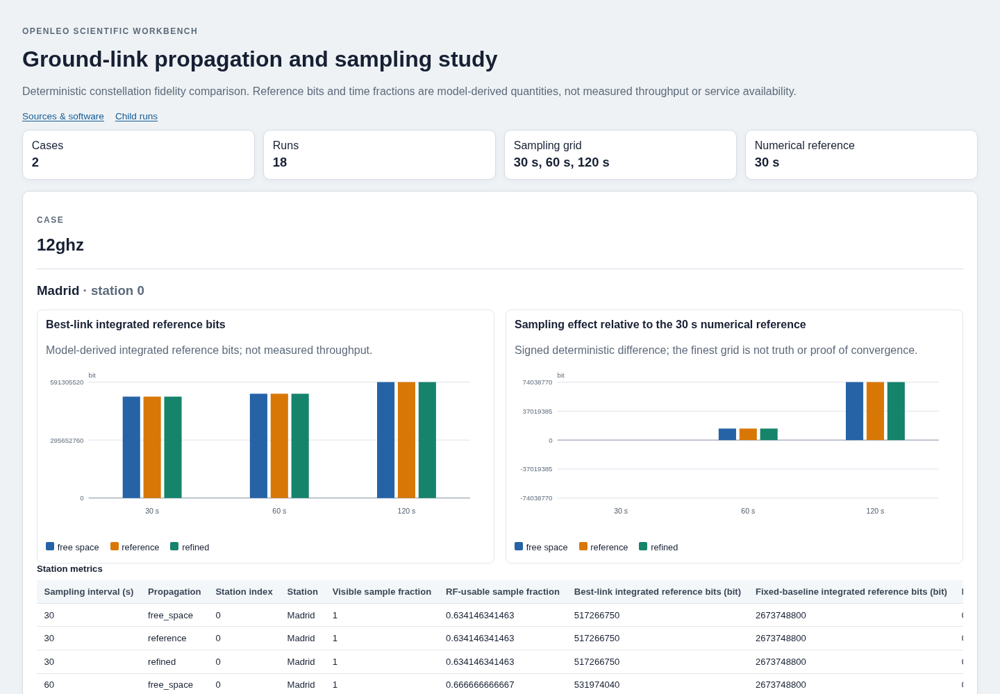

# Constellation fidelity studies

A fidelity study compares explicit constellation scenarios at several sampling
intervals. Each combination runs the same three propagation cases: free space,
the reference atmosphere, and a refined atmospheric layer grid. It answers how
model-derived results change under those declared choices; it does not establish
errors against measured truth or estimate uncertainty distributions.

## Run and inspect

From an installed repository checkout:

```bash
uv run --no-dev openleo fidelity-study \
  examples/studies/reference_fidelity.json --output runs/fidelity
```

Open `runs/fidelity/index.html`. Its plots and tables compare station reference
bits, sampling differences, and routing metrics. Each listed run opens its own
interactive 3D workbench. The comparison itself requires no JavaScript, external
assets, map service, server, or plotting dependency. Share the complete directory
to preserve access to the child reports.



The bundled example runs 18 experiments: two explicit carrier frequencies,
three sampling intervals, and three propagation variants. It uses the archived
80-object catalog, four declared station locations, and the fixed window
2026-09-10 12:00–12:20 UTC. The 12 GHz and 20 GHz scenarios hold the declared
EIRP and antenna gains fixed; this is not a comparison at fixed antenna aperture
and does not reconstruct an operator's radio system. Catalog provenance is in
[Third-party data](../THIRD_PARTY_DATA.md).

## Define a study

```json
{
  "schema_version": "1",
  "name": "Ground-link propagation and sampling study",
  "cases": [
    {"id": "12ghz", "scenario": "reference_12ghz.json"},
    {"id": "20ghz", "scenario": "reference_20ghz.json"}
  ],
  "sampling_steps_s": [30.0, 60.0, 120.0]
}
```

Scenario filenames resolve relative to the study file. Each scenario uses the
[constellation input format](WORKBENCH.md) and explicitly enables
`itu_reference` propagation with starting refinement 1 or 2. Station positions,
AMSL heights, carrier frequency, receiver noise and all RF/network settings belong
to those scenario files. The study runner changes only the sampling interval and
the declared propagation variant; it supplies no weather observations or hidden
parameter defaults.

The input contract requires:

- 1–8 cases with unique IDs matching `[a-z0-9][a-z0-9_-]{0,47}`; Windows reserved
  device names such as `con`, `nul`, `com1` and `lpt1` are not portable IDs.
- 2–6 distinct, finite, positive sampling intervals, sorted by the reader.
- Sampling intervals satisfying the existing microsecond-resolution time contract.
- Positive-duration scenario windows and unchanged input files between loading and
  running the study.
- Valid catalog fingerprints and existing per-experiment bounds.
- At most 2,000,000 satellite–station–sample combinations across the entire study,
  including all three propagation variants.

All scenarios and the computation budget are checked before outputs are created.
The runner uses private temporary storage and publishes a completed directory only
after every case succeeds. Existing nonempty outputs are refused: choose a new
directory instead of overwriting results.

## What is held fixed

At each case and sampling interval:

| Propagation variant | Change |
| --- | --- |
| `free_space` | Omit atmospheric propagation; retain the declared RF and network inputs |
| `reference` | Use the scenario's reference profile and starting layer refinement |
| `refined` | Double that layer refinement; retain all other inputs |

The three variants share station geometry, satellite samples and timestamps.
Across sampling intervals, every scenario field except `time_window.step_s` remains
fixed. Each run starts its own link-adaptation history. Consequently, differences
can include the effect of sampling on both geometry and stateful MODCOD hysteresis.

The minimum declared interval is the **numerical reference**, not ground truth.
A small difference from it does not prove convergence; a large difference indicates
that the chosen discretization needs further investigation. Atmospheric layer-grid
differences are recorded separately from sampling differences.

## Sample fractions versus durations

Existing sample fractions are retained for compatibility: qualifying samples divided
by the number of inclusive samples. New duration metrics weight each state by its
actual following interval. For timestamps $t_i$ and a state indicator $q_i$,

$$
D_q=\sum_{i=0}^{N-2}q_i(t_{i+1}-t_i),\qquad
F_q=\frac{D_q}{t_{N-1}-t_0}.
$$

This is a left-held model on $[t_i,t_{i+1})$. A shorter final interval contributes
its actual duration, and the final sample contributes no additional duration.
No event interpolation or duration beyond the requested stop is inferred.

For example, at times 0, 4 and 10 seconds, visibility states `[true, true, false]`
and RF-usability states `[true, false, false]` imply 10 visible seconds, 4 usable
seconds, and 6 visible-but-RF-unusable seconds. The usable **time fraction** is
0.4, while the usable **sample fraction** is 1/3. This is an analytical example,
not a satellite observation. Neither fraction is a statistical availability probability.

Station durations distinguish geometric absence (`out_of_view_duration_s`) from
visible RF outage (`rf_outage_duration_s`). Whole-window mean reference rates divide
integrated bits by the full study-window duration, including outages. They are not
means conditional on successful reception.

## Outputs and verification

| Artifact | Contents |
| --- | --- |
| `fidelity-study.json` | Study fingerprint, software versions, run identities, metrics, comparisons and limitations |
| `station-metrics.csv` | Station sample/time fractions, durations, reference bits and signed differences |
| `route-metrics.csv` | Routing sample/time fractions, durations, bottleneck reference bits and signed differences |
| `index.html` | Standalone comparison with plots, quantitative axes, tables and child-report links |
| `manifest.json` | SHA-256 hashes of those four top-level files |
| `cases/<id>/step-<index>/<model>/` | Normal workbench bundles with separate manifests |

Step indices follow ascending sampling intervals. JSON preserves binary64 round-trip
values. CSV columns are deterministic and include units in their field names; finite
floats use 15 significant digits. Potential spreadsheet-formula strings are prefixed
with an apostrophe in CSV; authoritative JSON retains the original text. HTML tables
display values with 12 significant digits.

`delta_bits_to_finest` is current integrated reference bits minus those from the
smallest step for the same scenario, propagation model and station/routing model.
`relative_delta_percent_to_finest` is that difference divided by the numerical
reference bits, times 100. It is JSON `null`/empty CSV when the denominator is zero.
`delta_bits_to_free_space` compares propagation variants at the same time step.

```python
from openleo.fidelity_io import load_fidelity_result

summary = load_fidelity_result("runs/fidelity")
print(summary["numerical_reference_step_s"])
```

The loader verifies top-level and child artifact hashes, run identities, complete
model/sampling combinations, preserved input relationships, and metrics rederived
from child results. It also checks the exported CSV tables against those values.
It does not rerun orbit or atmospheric physics. Hashes detect changes relative to
the recorded manifests; they do not authenticate an author. The study configuration,
scenario files and archived catalog are separate inputs required to recompute a study.

## Reference example results

For Madrid with the reference atmosphere, the bundled 20-minute example produces:

| Carrier | Step (s) | RF-usable duration (s) | Best-link reference bits | Difference from 30 s (%) |
| --- | ---: | ---: | ---: | ---: |
| 12 GHz | 30 | 750 | 517266750 | 0 |
| 12 GHz | 60 | 780 | 531974040 | 2.84327 |
| 12 GHz | 120 | 840 | 591305520 | 14.31346 |
| 20 GHz | 30 | 120 | 58829160 | 0 |
| 20 GHz | 60 | 180 | 88243740 | 50 |
| 20 GHz | 120 | 240 | 117658320 | 100 |

These are computed effects of the declared sampling choices, including left-held
states and reference adaptation. They are not measured throughput, error percentages
against truth, or evidence that the 30-second grid is sufficiently fine for an
operational decision. Other windows, RF margins and station choices can give different
results, including no differences.

Scientific equations and evidence boundaries remain in [Methods](METHODS.md),
[Reference propagation](REFERENCE_PROPAGATION.md) and [Validation](VALIDATION.md).
