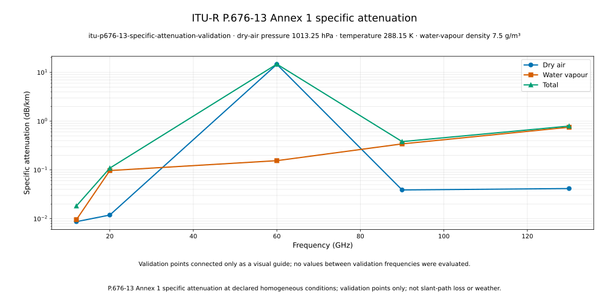

# ITU-R P.676-13 Specific Gaseous Attenuation

OpenLEO v0.2b1 implements the line-by-line method in Recommendation
[ITU-R P.676-13](https://www.itu.int/rec/R-REC-P.676-13-202208-I/en), Annex 1,
for one homogeneous thermodynamic state. The result is **specific attenuation in
dB/km**. It is not a path-integrated loss, an Earth-space slant-path model, or a
weather observation.

## Quantity And Units

The public function is:

```python
specific_gaseous_attenuation(
    frequency_hz,
    dry_air_pressure_hpa,
    temperature_k,
    water_vapour_density_g_per_m3,
)
```

It returns immutable dry-air, water-vapour, and total components in dB/km. Public
frequency is in hertz; the implementation validates it in the Annex 1 range from
1 GHz through 1,000 GHz and converts it once to gigahertz for the P.676 equations.

For temperature $T$ in kelvin and water-vapour density $\rho$ in g/m³, the water-vapour
partial pressure is

$$
e=\frac{\rho T}{216.7}\quad\mathrm{hPa}.
$$

The declared pressure input $p$ is dry-air pressure, not total barometric pressure.
With $f$ in GHz and the imaginary refractivities from the oxygen and water-vapour
line sums,

$$
\gamma_o=0.1820 f N''_O,\qquad
\gamma_w=0.1820 f N''_W,\qquad
\gamma=\gamma_o+\gamma_w,
$$

where every $\gamma$ is in dB/km. The implementation evaluates the full Annex 1 line
strengths, widths, line shapes, oxygen line mixing, and dry continuum with
$\theta=300/T$. See
[`src/openleo/gases.py`](../src/openleo/gases.py) and the fixed coefficient tuples in
[`src/openleo/_p676_coefficients.py`](../src/openleo/_p676_coefficients.py).

## Official Validation Benchmark

The frozen benchmark uses:

| Quantity | Value |
| --- | ---: |
| Dry-air pressure $p$ | 1013.25 hPa |
| Temperature $T$ | 288.15 K |
| Water-vapour density $\rho$ | 7.5 g/m³ |
| Derived water-vapour partial pressure $e$ | 9.97288878634056 hPa |

The following values are literal outputs from the official ITU validation workbook:

| Frequency (GHz) | Dry air (dB/km) | Water vapour (dB/km) | Total (dB/km) |
| ---: | ---: | ---: | ---: |
| 12 | 0.00869826406877357 | 0.00953538822024593 | 0.0182336522890195 |
| 20 | 0.0118835504778076 | 0.0970473048151117 | 0.108930855292919 |
| 60 | 14.6234747964861 | 0.154841840636247 | 14.7783166371223 |
| 90 | 0.0388697110724235 | 0.341973394422181 | 0.380843105494605 |
| 130 | 0.0415090835995228 | 0.751844703646129 | 0.793353787245652 |

Tests compare all three components at every frequency with relative tolerance
`1e-12` and absolute tolerance `1e-13`. The in-memory total is also required to equal
the single addition of its dry-air and water-vapour components exactly.

The official source is
[`CG-3M3J-13-ValEx-Rev8.3.0.xlsx`](https://www.itu.int/en/ITU-R/study-groups/rsg3/rwp3m/Validation%20Example/CG-3M3J-13-ValEx-Rev8.3.0.xlsx),
with SHA-256:

```text
e2d8d864c80f59752318548cdd75d818792b44574da6e41dbdc5cb722aab7546
```

The workbook is not redistributed by OpenLEO. The small public JSON configuration
records the declared conditions and frequencies; its raw-byte SHA-256 is:

```text
8bb73d2f3b3fe971cee54fa5feeeb4e041e2e77a3f272dc83842614d996e7bc0
```

## Implementation Provenance And License

The equations and coefficient data were adapted from the MIT-licensed
[ITU-Rpy repository](https://github.com/inigodelportillo/ITU-Rpy) at commit
`f739993c4b6d34076de22249ef53d03fa5a53d73`. The exact adapted sources are:

- `itur/models/itu676.py`
- `itur/data/676/v13_lines_oxygen.txt`
- `itur/data/676/v13_lines_water_vapour.txt`

The complete upstream MIT notice and attribution are retained in
[`THIRD_PARTY_NOTICES.md`](../THIRD_PARTY_NOTICES.md). ITU-Rpy is the attributed
implementation and coefficient source; P.676-13 and its official workbook remain the
scientific authorities. OpenLEO uses standard-library `math` loops and adds no runtime
dependency for this calculation.

## Reproduce The Artifacts

Run the benchmark without Matplotlib:

```bash
uv run openleo gases examples/atmosphere/p676_13_validation.json \
  --output runs/p676-validation
```

This writes:

```text
runs/p676-validation/
├── gaseous-specific-attenuation.csv
└── gaseous-specific-attenuation-summary.json
```

The CSV contains the ordered frequencies and three specific-attenuation components.
The summary records the configuration fingerprint, the exact CSV filename and SHA-256,
declared and derived conditions, Recommendation and method, coefficient provenance,
official workbook provenance, package version, numeric format, ordering, and
limitations. The plotter verifies the CSV fingerprint before rendering. Finite floats
use 15 significant digits in both artifacts.

Render the completed artifacts separately:

```bash
uv run openleo plot-gases runs/p676-validation \
  --output docs/images/p676-13-specific-attenuation.svg
```



The logarithmic curves connect only the five evaluated validation points as a visual
guide. No values between those frequencies were calculated for the figure. If a valid
artifact contains zero attenuation, the renderer omits that undefined log-scale point
and states the omission explicitly on the figure; the calculation and CSV retain zero.

## Claim Boundary And Non-Goals

The standalone `openleo gases` benchmark deliberately does not:

- integrate specific attenuation along a vertical, terrestrial, or slant path;
- use a P.835 atmospheric profile or model refraction;
- modify the existing pass `trace.csv`, link budget, `C/N0`, SNR, or capacity bound;
- model rain, cloud, fog, scintillation, availability, or combined propagation loss;
- use live weather, ERA5, radiosonde, or station measurements; or
- establish calibrated RF or operator-performance validation.

The current result answers one narrower question: under a declared homogeneous state,
what specific attenuation does the P.676-13 Annex 1 line-by-line method predict at the
selected frequencies?

Since v0.4, the separate constellation workflow can integrate these specific losses
through an idealized P.835-7 reference atmosphere, including refraction and excess
delay. See [Reference propagation](REFERENCE_PROPAGATION.md). That optional model
does not change the purpose or values of this homogeneous-state benchmark.
